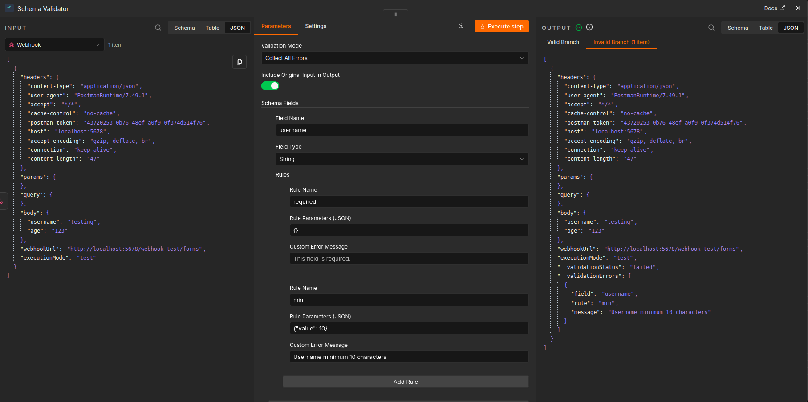

# n8n-nodes-schema-validator

An n8n community node for validating input data against a configurable schema, without writing any code.

## Features
- Configure validation schemas entirely through the n8n UI
- Supports strings, numbers, booleans, arrays, and dates
- Dozens of built-in validation rules (e-mail, URL, min, max, regex, IP, etc.)
- Supports cross-field validation like "same", "different", and "confirmed" (passwords)
- Validates nested properties automatically via dot-notation
- Optionally collect all errors or abort early on the first error

## Documentation

- [Usage Guide](docs/usage.md)
- [Validation Rules Reference](docs/rules-reference.md)

## License
MIT
